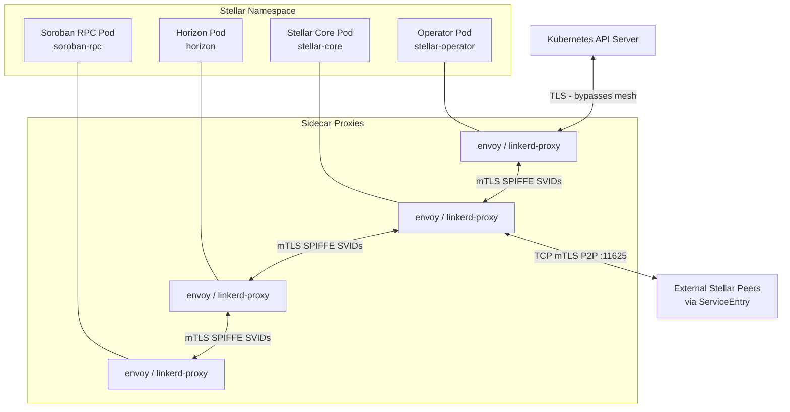

# Service Mesh mTLS for Stellar-K8s

## Introduction

This guide describes how to deploy Stellar-K8s behind a service mesh — either **Istio** or **Linkerd** — with strict mutual TLS (mTLS) enforced at the mesh layer. In high-compliance environments, per-application TLS is insufficient: the mesh must cryptographically verify every pod-to-pod connection regardless of application-level support.

The service mesh sidecar proxy (Envoy for Istio, linkerd-proxy for Linkerd) is injected alongside each Stellar-K8s pod and transparently intercepts all inbound and outbound network traffic. This enables:

- **Cryptographic workload identity** via SPIFFE SVIDs — no shared secrets or manually rotated certificates between pods.
- **Strict mTLS enforcement** — plaintext pod-to-pod connections are rejected at the proxy layer.
- **Fine-grained authorization** — only the four known Stellar-K8s identities may communicate with each other.
- **Observability** — mesh telemetry provides per-connection TLS metadata for audit logging.

The Stellar-K8s operator itself requires no source changes. The Envoy sidecar transparently proxies the operator's outbound Kubernetes API calls, so the reconciliation loop continues to function correctly after injection.

> **Scope**: This guide covers mesh-layer mTLS for pod-to-pod traffic. The operator-managed mTLS certificates described in [`docs/mtls-guide.md`](./mtls-guide.md) remain active for the operator REST API and per-node client authentication — those are separate certificate layers. See the [Architecture Overview](#architecture-overview) for the full certificate layer breakdown.

---

## Glossary Reference

The following terms are used throughout this guide. Full definitions are in [`requirements.md`](../.kiro/specs/service-mesh-mtls/requirements.md).

| Term | Short Definition |
|---|---|
| **Service_Mesh** | Infrastructure layer (Istio or Linkerd) handling service-to-service communication, mTLS, and observability |
| **Sidecar** | Proxy container (Envoy / linkerd-proxy) injected alongside each Stellar-K8s pod |
| **mTLS** | Mutual TLS — both client and server present certificates, providing bidirectional identity verification |
| **PeerAuthentication** | Istio CRD defining the mTLS mode (STRICT / PERMISSIVE / DISABLE) for a namespace or workload |
| **AuthorizationPolicy** | Istio CRD controlling which services may communicate based on verified identity |
| **ServiceEntry** | Istio CRD registering external services (e.g., Stellar P2P peers) into the mesh service registry |
| **VirtualService** | Istio CRD defining traffic routing rules for services within or entering the mesh |
| **DestinationRule** | Istio CRD defining connection policies (including TLS mode) for traffic to a specific service |
| **SPIFFE** | Secure Production Identity Framework for Everyone — the identity standard used by both Istio and Linkerd |
| **SVID** | SPIFFE Verifiable Identity Document — the X.509 certificate issued to each workload by the mesh CA |
| **P2P_Port** | Stellar Core peer-to-peer port (default 11625) used for inter-node gossip and consensus |

---

## Prerequisites

Before following this guide, ensure the following are in place:

### Service Mesh

- **Istio 1.17+** installed in the cluster (`istioctl version` to verify), **or**
- **Linkerd 2.12+** installed in the cluster (`linkerd version` to verify)

Only one mesh is required. The Istio and Linkerd sections of this guide are independent — follow the section that matches your environment.

### Kubernetes

- **Kubernetes 1.28+** — required for stable sidecar container support and the admission webhook behavior this guide depends on.

### Stellar-K8s Operator

- The Stellar-K8s operator must be deployed in the **`stellar` namespace** before enabling mesh injection.
- The following service accounts must exist in the `stellar` namespace:

  | Service Account | Used By |
  |---|---|
  | `stellar-operator` | Stellar-K8s operator pod |
  | `stellar-core` | Stellar Core pods |
  | `stellar-horizon` | Horizon pods |
  | `stellar-soroban` | Soroban RPC pods |

  Verify with:
  ```bash
  kubectl get serviceaccounts -n stellar
  ```

### CLI Tools

- **`istioctl`** (if using Istio) — install from [istio.io/latest/docs/setup/getting-started](https://istio.io/latest/docs/setup/getting-started/)
- **`linkerd`** (if using Linkerd) — install from [linkerd.io/2/getting-started](https://linkerd.io/2/getting-started/)
- **`kubectl`** 1.28+ configured with cluster access

---

## Architecture Overview

### How the Mesh Intercepts Stellar-K8s Traffic

When sidecar injection is enabled for the `stellar` namespace, the mesh admission webhook mutates each new pod spec to add a sidecar proxy container (Envoy for Istio, linkerd-proxy for Linkerd) and an init container that configures `iptables` rules. These rules redirect all inbound and outbound TCP traffic through the proxy — the application container is unaware of this interception.

For the Stellar-K8s operator, this means:
- Outbound calls to the Kubernetes API server are proxied through Envoy/linkerd-proxy. The proxy passes them through transparently (TLS is handled at the application layer for API server calls).
- Inbound REST API calls to the operator are intercepted by the sidecar, which enforces mTLS before forwarding to the operator process.
- All pod-to-pod traffic within the `stellar` namespace (operator → core, core → horizon, etc.) is encrypted and authenticated using mesh-issued SPIFFE SVIDs.

### Trust Model

Both Istio and Linkerd use SPIFFE as the identity standard. Each pod receives an X.509 SVID with a URI SAN of the form:

```
spiffe://<trust-domain>/ns/<namespace>/sa/<service-account>
```

The mesh CA (Istiod or Linkerd's identity controller) issues and rotates these certificates automatically — no manual certificate management is required for pod-to-pod traffic.

| Workload | Service Account | SPIFFE Identity |
|---|---|---|
| Operator | `stellar-operator` | `spiffe://cluster.local/ns/stellar/sa/stellar-operator` |
| Stellar Core | `stellar-core` | `spiffe://cluster.local/ns/stellar/sa/stellar-core` |
| Horizon | `stellar-horizon` | `spiffe://cluster.local/ns/stellar/sa/stellar-horizon` |
| Soroban RPC | `stellar-soroban` | `spiffe://cluster.local/ns/stellar/sa/stellar-soroban` |

### Certificate Layers

Mesh SVIDs cover pod-to-pod traffic intercepted by the sidecar. The operator-managed certificates from `docs/mtls-guide.md` remain active for their respective traffic paths and are not replaced by the mesh.

| Traffic Path | Certificate Layer |
|---|---|
| Pod-to-pod within mesh | Mesh SVID (Istio/Linkerd CA) |
| Operator REST API | Operator-managed cert (`stellar-operator-server-cert`) |
| StellarNode client auth | Operator-managed cert (`<node>-client-cert`) |
| External P2P (non-meshed peer) | Application-layer TLS or plaintext (per peer config) |

### Traffic Flow Diagram

The following diagram shows how sidecar proxies intercept traffic for all four Stellar-K8s pods:



Key observations from the diagram:

- Each Stellar pod is paired with its own sidecar proxy. The proxy intercepts all traffic before it leaves or enters the pod.
- Pod-to-pod connections within the mesh use mTLS authenticated by SPIFFE SVIDs — the application layer does not need to manage these certificates.
- Stellar Core's P2P port (11625) is TCP, not HTTP. Both meshes handle this differently: Istio uses an Envoy TCP proxy filter; Linkerd uses opaque port proxying. See the respective sections for details.
- The operator's outbound calls to the Kubernetes API Server bypass mesh mTLS (the API server is not meshed) — TLS is handled at the application layer as normal.

---

## Istio

### Sidecar Injection

#### Namespace-Level Injection

Enable automatic sidecar injection for the entire `stellar` namespace by applying the `istio-injection: enabled` label. Once labeled, the Istio admission webhook intercepts every new pod creation in the namespace and mutates the pod spec to add the Envoy sidecar — no changes to individual workload manifests are required.

**Imperative command:**

```bash
kubectl label namespace stellar istio-injection=enabled
```

**Declarative namespace manifest:**

```yaml
apiVersion: v1
kind: Namespace
metadata:
  name: stellar
  labels:
    istio-injection: "enabled"
```

After labeling, any new pod created in the namespace will have the Envoy sidecar injected automatically by the Istio admission webhook. Existing pods are not affected — restart them (e.g., roll the deployment) to pick up the sidecar.

#### Workload-Level Opt-Out

Individual pods or deployments can opt out of injection even when namespace-level injection is enabled. This is useful for jobs, batch workloads, or any Stellar-K8s component that must not participate in the mesh (for example, a one-off migration job that needs direct network access).

Add the following annotation to the pod template metadata:

```yaml
metadata:
  annotations:
    sidecar.istio.io/inject: "false"
```

Full deployment example:

```yaml
apiVersion: apps/v1
kind: Deployment
metadata:
  name: stellar-migration-job
  namespace: stellar
spec:
  template:
    metadata:
      annotations:
        sidecar.istio.io/inject: "false"
    spec:
      containers:
        - name: migration
          image: stellar-migration:latest
```

#### Operator Reconciliation Loop Compatibility

The Stellar-K8s operator reconciliation loop continues to function correctly after sidecar injection — no operator source changes are required. The Envoy sidecar transparently proxies the operator's outbound Kubernetes API calls: `iptables` rules redirect all outbound TCP traffic through the Envoy proxy, which passes Kubernetes API Server connections through without modification (the API server is not meshed, so TLS is handled at the application layer as normal).

If the operator pod cannot reach the API server after injection, check the `istio-proxy` logs for connection errors and verify that the `istiod` control plane is healthy:

```bash
# Check istio-proxy logs on the operator pod
kubectl logs -n stellar -l app=stellar-operator -c istio-proxy

# Verify istiod is running
kubectl get pods -n istio-system -l app=istiod
```

#### Verifying Sidecar Injection

After enabling injection and restarting pods, verify that each Stellar pod has two containers — the application container and `istio-proxy`.

**Detailed container listing:**

```bash
kubectl get pod -n stellar -o jsonpath='{range .items[*]}{.metadata.name}{"\t"}{range .spec.containers[*]}{.name}{","}{end}{"\n"}{end}'
```

Expected output (one line per pod):

```
stellar-operator-7d9f8b-xk2lp    stellar-operator,istio-proxy,
stellar-core-0                   stellar-core,istio-proxy,
horizon-6c4d9f-p8rnq             horizon,istio-proxy,
soroban-rpc-5b7c8d-m3tnv         soroban-rpc,istio-proxy,
```

**Quick check:**

```bash
kubectl get pods -n stellar
```

The `READY` column should show `2/2` for each pod (application container + `istio-proxy`). A value of `1/1` means the sidecar was not injected — confirm the namespace label is set and the pod was created after labeling.

#### Troubleshooting Pod Startup Failures

If a Stellar pod fails to start after sidecar injection is enabled, work through the following checklist:

| # | Issue | What to Check | Resolution |
|---|---|---|---|
| 1 | **Resource limits** | The `istio-proxy` container requires CPU and memory headroom. If namespace resource quotas are too restrictive, the sidecar container will be OOMKilled or fail to schedule. | Ensure the namespace quota allows at least an additional **100m CPU** and **128Mi memory** per pod for the sidecar. Check quotas with `kubectl describe resourcequota -n stellar`. |
| 2 | **Init container ordering** | The `istio-init` container must complete before the application container starts. If `istio-init` is stuck, the pod will not progress. | Check init container status: `kubectl describe pod <pod-name> -n stellar`. Look for `istio-init` in the `Init Containers` section and check its exit code and logs. |
| 3 | **istio-proxy readiness** | If the `istio-proxy` readiness probe is failing, Kubernetes will not mark the pod as ready, which can block dependent services. | Check sidecar logs: `kubectl logs <pod-name> -n stellar -c istio-proxy`. Look for errors connecting to `istiod` or certificate issuance failures. |
| 4 | **istiod connectivity** | If `istiod` is unhealthy, sidecars cannot obtain certificates and will fail to start. | Verify the control plane: `kubectl get pods -n istio-system`. All `istiod` pods should be in `Running` state with `1/1` ready. |
| 5 | **Webhook configuration** | If pods are not getting sidecars injected despite the namespace label being set, the mutating webhook may be misconfigured or the webhook pod may be unhealthy. | Verify the webhook: `kubectl get mutatingwebhookconfiguration istio-sidecar-injector`. Confirm the `namespaceSelector` matches the `stellar` namespace label. |

### Strict mTLS (PeerAuthentication)

#### Namespace-Scoped PeerAuthentication

Apply a `PeerAuthentication` policy to the `stellar` namespace to enforce STRICT mTLS for all pods in that namespace. With `STRICT` mode, Envoy rejects any plaintext inbound connection with a TCP RST — only mTLS connections carrying a valid SPIFFE SVID are accepted.

```yaml
apiVersion: security.istio.io/v1beta1
kind: PeerAuthentication
metadata:
  name: stellar-strict-mtls
  namespace: stellar
spec:
  mtls:
    mode: STRICT
```

Save this as `peer-authentication-stellar.yaml` and apply:

```bash
kubectl apply -f peer-authentication-stellar.yaml
```

#### Mesh-Wide PeerAuthentication (Alternative)

If all workloads in the cluster are meshed, you can enforce STRICT mTLS cluster-wide by applying a `PeerAuthentication` in the `istio-system` namespace with the name `default`. This applies to every namespace in the cluster.

```yaml
apiVersion: security.istio.io/v1beta1
kind: PeerAuthentication
metadata:
  name: default
  namespace: istio-system
spec:
  mtls:
    mode: STRICT
```

> **Warning**: This applies STRICT mTLS to ALL namespaces in the cluster. Use this only if every workload in the cluster has a sidecar injected. Any non-meshed pod (e.g., a legacy service or a job without injection) will have its inbound connections rejected.

#### STRICT vs PERMISSIVE Mode

| Mode | Behavior | When to Use |
|---|---|---|
| `STRICT` | Only mTLS connections accepted. Plaintext is rejected with TCP RST. | Production — all pods are meshed |
| `PERMISSIVE` | Both mTLS and plaintext accepted. | Migration window — gradually onboarding workloads |
| `DISABLE` | mTLS disabled. Only plaintext accepted. | Not recommended for production |

**Migration guidance**: Start with `PERMISSIVE` to verify all workloads can communicate through the mesh. Once all pods show `2/2` READY (confirming the sidecar is injected), switch to `STRICT`. This avoids disrupting services that haven't yet been injected.

```bash
# Step 1: Apply PERMISSIVE during migration
kubectl apply -f - <<EOF
apiVersion: security.istio.io/v1beta1
kind: PeerAuthentication
metadata:
  name: stellar-strict-mtls
  namespace: stellar
spec:
  mtls:
    mode: PERMISSIVE
EOF

# Step 2: Verify all pods show 2/2 READY
kubectl get pods -n stellar

# Step 3: Switch to STRICT once all pods are meshed
kubectl patch peerauthentication stellar-strict-mtls -n stellar \
  --type=merge -p '{"spec":{"mtls":{"mode":"STRICT"}}}'
```

### AuthorizationPolicy

The `AuthorizationPolicy` below restricts communication within the `stellar` namespace to only the four known Stellar-K8s SPIFFE identities. Any other principal — including unauthenticated or plaintext clients — will be denied by default.

```yaml
apiVersion: security.istio.io/v1beta1
kind: AuthorizationPolicy
metadata:
  name: stellar-allow-internal
  namespace: stellar
spec:
  action: ALLOW
  rules:
    - from:
        - source:
            principals:
              - "cluster.local/ns/stellar/sa/stellar-operator"
              - "cluster.local/ns/stellar/sa/stellar-core"
              - "cluster.local/ns/stellar/sa/stellar-horizon"
              - "cluster.local/ns/stellar/sa/stellar-soroban"
```

Apply with:

```bash
kubectl apply -f authorization-policy-stellar.yaml
```

This policy works in conjunction with `PeerAuthentication STRICT`: the mesh first verifies the mTLS handshake (via `PeerAuthentication`), then checks the verified SPIFFE principal against this policy. A connection from any workload outside the four listed service accounts — including any pod without a sidecar — will be denied.

#### Certificate Layer Separation

When `PeerAuthentication` is set to `STRICT`, the mesh handles pod-to-pod traffic using mesh-issued SVIDs. However, the operator-managed mTLS certificates described in [`docs/mtls-guide.md`](./mtls-guide.md) remain fully active for their respective traffic paths — the mesh does **not** replace them.

| Traffic Path | Certificate Layer |
|---|---|
| Pod-to-pod within mesh | Mesh SVID (Istiod CA) — intercepted by Envoy sidecar |
| Operator REST API | Operator-managed cert (`stellar-operator-server-cert`) |
| StellarNode client auth | Operator-managed cert (`<node>-client-cert`) |
| External P2P (non-meshed peer) | Application-layer TLS or plaintext (per peer config) |

These are separate certificate layers operating at different points in the network stack:

- The Envoy sidecar intercepts pod-to-pod TCP connections and performs the mTLS handshake using the SVID issued by Istiod. The application container is unaware of this layer.
- The operator REST API and per-node client certificates are managed by the Stellar-K8s operator (as described in `docs/mtls-guide.md`) and terminate at the application layer — the sidecar passes this traffic through transparently.

See the [Certificate Layers](#certificate-layers) table in the Architecture Overview section for the full breakdown.

#### Verification Commands

Use `istioctl` to confirm that mTLS and authorization policies are correctly enforced for pods in the `stellar` namespace.

```bash
# Check authorization policy enforcement for a specific pod
istioctl x authz check <pod-name> -n stellar

# Check mTLS configuration for a pod (inbound listener on port 15006 is the sidecar intercept port)
istioctl proxy-config listener <pod-name>.stellar --port 15006

# Check TLS mode for outbound connections to stellar-core
istioctl proxy-config cluster <pod-name>.stellar --fqdn stellar-core.stellar.svc.cluster.local

# Verify PeerAuthentication is applied
kubectl get peerauthentication -n stellar
kubectl get peerauthentication -n istio-system
```

### Cross-Cluster P2P

#### Multi-Cluster Topology Options

Istio supports two multi-cluster topologies. Choose the right one based on your resilience requirements.

| Topology | Control Plane | Resilience | Complexity |
|---|---|---|---|
| **Multi-primary** | Each cluster runs its own Istiod | High — clusters operate independently | Higher — requires shared or federated CA |
| **Primary-remote** | One cluster runs Istiod; remote sidecars connect to it | Lower — remote cluster depends on primary's control plane | Lower — single control plane to manage |

**Recommendation: Use multi-primary for Stellar P2P workloads.**

Stellar Core nodes must maintain consensus independently. If one cluster's control plane goes down, the other must continue to operate without interruption. Multi-primary satisfies this requirement — each cluster has its own Istiod, so a control plane failure in one cluster does not affect the other. Primary-remote is simpler to operate but introduces a single point of failure that is incompatible with Stellar's consensus requirements.

#### DestinationRule for Cross-Cluster P2P mTLS

Apply the following `DestinationRule` to instruct Envoy to use the mesh-issued SVID for the mTLS handshake on port 11625, rather than relying on application-layer TLS. The `ISTIO_MUTUAL` mode tells Envoy to present its own SPIFFE certificate and verify the remote peer's certificate using the mesh CA — no application-level certificate management is required for this traffic path.

```yaml
apiVersion: networking.istio.io/v1beta1
kind: DestinationRule
metadata:
  name: stellar-core-p2p-mtls
  namespace: stellar
spec:
  host: "*.stellar-core.stellar.svc.cluster.local"
  trafficPolicy:
    portLevelSettings:
      - port:
          number: 11625
        tls:
          mode: ISTIO_MUTUAL
```

Apply with:

```bash
kubectl apply -f destination-rule-p2p-mtls.yaml
```

#### Shared Root CA and Federated Trust

For SVIDs issued in one cluster to be trusted by peers in another cluster, both clusters must share a common root CA or have federated trust configured. Without this, the mTLS handshake between clusters will fail with a certificate verification error.

**Option 1 — Shared root CA**

Both clusters use the same root CA certificate. Configure this by providing the same `cacerts` secret in `istio-system` on both clusters before installing Istio:

```bash
kubectl create secret generic cacerts -n istio-system \
  --from-file=ca-cert.pem \
  --from-file=ca-key.pem \
  --from-file=root-cert.pem \
  --from-file=cert-chain.pem
```

Run this command on each cluster before running `istioctl install`. Istiod will use the provided CA material instead of generating a self-signed root, ensuring both clusters issue SVIDs that chain to the same root.

**Option 2 — Federated trust**

Each cluster has its own intermediate CA, but both trust the same root. Configure using `meshConfig.trustDomain` and cross-cluster trust bundles. This is more operationally complex but allows each cluster to manage its own intermediate CA independently.

Verify that trust is correctly configured by inspecting the certificate chain on a running pod:

```bash
istioctl proxy-config secret <pod-name>.stellar
```

The output should show the full certificate chain including the shared root CA.

#### ServiceEntry for Remote Stellar Core Peers

Register remote Stellar Core peers (external to the local cluster) into the local mesh service registry using a `ServiceEntry`. This makes the remote peer a known host in the mesh, allowing the `DestinationRule` above to apply `ISTIO_MUTUAL` TLS to connections to it.

`MESH_EXTERNAL` tells Istio this service is outside the local mesh. The `DestinationRule` from the previous section then applies `ISTIO_MUTUAL` TLS to connections to this host, so Envoy performs the mTLS handshake using the mesh-issued SVID.

```yaml
apiVersion: networking.istio.io/v1beta1
kind: ServiceEntry
metadata:
  name: stellar-core-remote-cluster
  namespace: stellar
spec:
  hosts:
    - stellar-core.remote-cluster.example.com
  ports:
    - number: 11625
      name: p2p-tcp
      protocol: TCP
  resolution: DNS
  location: MESH_EXTERNAL
```

Apply with:

```bash
kubectl apply -f service-entry-remote-cluster.yaml
```

#### Validating Cross-Cluster P2P Certificates via Envoy Access Logs

Use Envoy access logs to confirm that P2P connections between Stellar Core nodes in different clusters are using mesh-issued certificates.

```bash
# Enable Envoy access logging (if not already enabled in mesh config)
kubectl edit configmap istio -n istio-system
# Set: accessLogFile: /dev/stdout

# Inspect access logs on the Stellar Core pod's sidecar
kubectl logs <stellar-core-pod> -n stellar -c istio-proxy | grep "11625"
```

Key fields to look for in the access log:

| Field | Expected Value | Meaning |
|---|---|---|
| `%DOWNSTREAM_TLS_VERSION%` | `TLSv1.3` | Confirms TLS 1.3 is negotiated |
| `%DOWNSTREAM_PEER_SUBJECT%` | Remote peer's SPIFFE identity (e.g., `spiffe://cluster.local/ns/stellar/sa/stellar-core`) | Confirms the remote peer presented a valid mesh-issued SVID |
| `%UPSTREAM_TRANSPORT_FAILURE_REASON%` | Empty | If non-empty, indicates a TLS handshake failure — check the CA trust configuration |

If `%UPSTREAM_TRANSPORT_FAILURE_REASON%` is non-empty, the most common causes are a CA trust mismatch (the remote cluster's SVID is not trusted by the local CA) or a missing `cacerts` secret. Revisit the shared root CA setup above.

#### Linkerd Multi-Cluster Equivalent

Linkerd provides cross-cluster connectivity through its multicluster extension and service mirroring. This achieves equivalent cross-cluster P2P connectivity without requiring shared CA configuration — Linkerd's gateway handles the cross-cluster mTLS automatically.

**Install the Linkerd multicluster extension:**

```bash
linkerd multicluster install | kubectl apply -f -
```

**Link the clusters** (run from the context of cluster-a, linking to cluster-b):

```bash
linkerd multicluster link --context=cluster-b | kubectl apply -f - --context=cluster-a
```

**Export the Stellar Core service from the remote cluster** by adding the mirror label:

```bash
kubectl label service stellar-core -n stellar mirror.linkerd.io/exported=true --context=cluster-b
```

This creates a mirrored service `stellar-core-cluster-b` in the local cluster that routes to the remote cluster's Stellar Core pods through an encrypted gateway connection. The local Stellar Core pod connects to `stellar-core-cluster-b` as if it were a local service — Linkerd handles the cross-cluster routing and mTLS transparently.

**Verify the multicluster setup:**

```bash
linkerd multicluster check
```

All checks should pass. If the gateway is not reachable, verify that the remote cluster's multicluster gateway service is exposed and that network policies permit traffic on the gateway port (default 4143).

### External Peer Discovery

#### ServiceEntry Manifests for External Peers

Register external Stellar peers into the mesh service registry using `ServiceEntry` resources. Istio requires external hosts to be registered before Envoy will route traffic to them (especially when `REGISTRY_ONLY` egress policy is active — see below).

**Mainnet validators (DNS resolution):**

```yaml
apiVersion: networking.istio.io/v1beta1
kind: ServiceEntry
metadata:
  name: stellar-mainnet-validators
  namespace: stellar
spec:
  hosts:
    - stellar-validator-1.example.com
    - stellar-validator-2.example.com
  ports:
    - number: 11625
      name: p2p-tcp
      protocol: TCP
  resolution: DNS
  location: MESH_EXTERNAL
```

**Testnet validators (DNS resolution):**

```yaml
apiVersion: networking.istio.io/v1beta1
kind: ServiceEntry
metadata:
  name: stellar-testnet-validators
  namespace: stellar
spec:
  hosts:
    - testnet-validator-1.stellar.org
    - testnet-validator-2.stellar.org
  ports:
    - number: 11625
      name: p2p-tcp
      protocol: TCP
  resolution: DNS
  location: MESH_EXTERNAL
```

**Custom private peers (STATIC resolution):**

```yaml
apiVersion: networking.istio.io/v1beta1
kind: ServiceEntry
metadata:
  name: stellar-private-peers
  namespace: stellar
spec:
  hosts:
    - private-peer-1.internal
  addresses:
    - 10.0.1.50
  ports:
    - number: 11625
      name: p2p-tcp
      protocol: TCP
  resolution: STATIC
  location: MESH_EXTERNAL
  endpoints:
    - address: 10.0.1.50
```

#### Resolution Field Options

The `resolution` field controls how Envoy resolves the destination address for connections to the registered host.

| Resolution | Behavior | When to Use |
|---|---|---|
| `DNS` | Envoy resolves the hostname at connection time using DNS. | Use for public validators with stable DNS names (mainnet/testnet validators). |
| `STATIC` | Envoy uses the IP addresses listed in `endpoints`. No DNS lookup. | Use for private peers with fixed IPs where DNS is not available or reliable. |

Use `DNS` for any external peer that has a stable, publicly resolvable hostname — this is the common case for mainnet and testnet validators. Use `STATIC` when the peer has a fixed IP address and no reliable DNS entry, such as a private peer on an internal network segment.

#### VirtualService for P2P Egress Timeout and Retry

Apply a `VirtualService` to set timeout and retry policies on outbound P2P connections to external validators. This prevents Stellar Core from waiting indefinitely on a slow or unresponsive peer.

```yaml
apiVersion: networking.istio.io/v1beta1
kind: VirtualService
metadata:
  name: stellar-p2p-egress
  namespace: stellar
spec:
  hosts:
    - stellar-validator-1.example.com
    - stellar-validator-2.example.com
    - testnet-validator-1.stellar.org
    - testnet-validator-2.stellar.org
  tcp:
    - match:
        - port: 11625
      route:
        - destination:
            host: stellar-validator-1.example.com
            port:
              number: 11625
      timeout: 30s
      retries:
        attempts: 3
        perTryTimeout: 10s
```

> **Note**: TCP VirtualServices have limited retry support compared to HTTP. The `timeout` field applies to the connection establishment phase. Retries for TCP connections are best-effort — Envoy will attempt to reconnect up to the specified number of times if the initial connection fails.

#### DestinationRule TLS Mode for External Peers

The TLS mode in the `DestinationRule` must match the remote peer's capabilities. Use `ISTIO_MUTUAL` only when the remote peer also runs Istio and participates in the same (or a federated) mesh trust domain.

```yaml
# For Istio-meshed external peers (both sides run Istio)
apiVersion: networking.istio.io/v1beta1
kind: DestinationRule
metadata:
  name: stellar-external-peers-istio
  namespace: stellar
spec:
  host: stellar-validator-1.example.com
  trafficPolicy:
    tls:
      mode: ISTIO_MUTUAL
---
# For non-meshed external peers (peer does not run Istio)
apiVersion: networking.istio.io/v1beta1
kind: DestinationRule
metadata:
  name: stellar-external-peers-plain
  namespace: stellar
spec:
  host: testnet-validator-1.stellar.org
  trafficPolicy:
    tls:
      mode: DISABLE
```

TLS mode selection:

- `ISTIO_MUTUAL`: Use when the remote peer also runs Istio. Envoy presents the mesh SVID and verifies the remote peer's SVID. Both sides must share a common root CA or have federated trust configured (see [Shared Root CA and Federated Trust](#shared-root-ca-and-federated-trust)).
- `SIMPLE`: Use when the remote peer uses standard TLS (not Istio mTLS). Envoy initiates TLS but does not present a client certificate. Suitable for peers that require server-side TLS only.
- `DISABLE`: Use when the remote peer does not use TLS (plaintext P2P). Not recommended for production — use only for development or testnet peers where encryption is not required.

#### REGISTRY_ONLY Egress Behavior

When `outboundTrafficPolicy` is set to `REGISTRY_ONLY`, Envoy blocks any outbound connection to a host that is not registered in a `ServiceEntry`. The connection is routed to a `BlackHoleCluster` and dropped immediately — no TCP connection is established.

The Envoy access log will show `response_flags: UH` (Upstream Unhealthy / no healthy upstream) for blocked connections:

```bash
# Diagnose blocked egress connections
kubectl logs <stellar-core-pod> -n stellar -c istio-proxy | grep "UH"
```

A log line with `UH` in the `response_flags` field indicates that Stellar Core attempted to connect to a host not registered in any `ServiceEntry`. To permit egress to a new peer, add a `ServiceEntry` for that host as shown in the manifests above, then re-apply:

```bash
kubectl apply -f service-entry-new-peer.yaml
```

The `ServiceEntry` takes effect immediately — no pod restart is required.

#### Sidecar Resource for REGISTRY_ONLY Egress Policy

Apply the following `Sidecar` resource to scope all pods in the `stellar` namespace to `REGISTRY_ONLY` egress. This prevents any Stellar pod from making outbound connections to hosts not explicitly registered in a `ServiceEntry`, providing defense-in-depth against unexpected egress (e.g., a compromised pod attempting to exfiltrate data to an unregistered host).

```yaml
apiVersion: networking.istio.io/v1beta1
kind: Sidecar
metadata:
  name: stellar-egress-policy
  namespace: stellar
spec:
  outboundTrafficPolicy:
    mode: REGISTRY_ONLY
  egress:
    - hosts:
        - "stellar/*"
        - "istio-system/*"
```

This `Sidecar` resource scopes all pods in the `stellar` namespace to only allow egress to hosts registered in `ServiceEntry` resources within the `stellar` and `istio-system` namespaces. Any connection to an unregistered host is blocked by Envoy, providing defense-in-depth against unexpected egress.

Apply with:

```bash
kubectl apply -f sidecar-egress-policy.yaml
```

After applying, verify that existing Stellar Core P2P connections still work by checking the Envoy access logs for `UH` flags. If any legitimate peer connections are blocked, add the corresponding `ServiceEntry` manifests before enforcing this policy in production.

### Verification

Use `istioctl` and `kubectl` to confirm that mTLS is active and authorization policies are correctly enforced for all pods in the `stellar` namespace.

```bash
# Verify mTLS is active for the operator pod
istioctl x authz check <stellar-operator-pod> -n stellar

# Verify mTLS is active for stellar-core
istioctl x authz check <stellar-core-pod> -n stellar

# Verify mTLS is active for horizon
istioctl x authz check <horizon-pod> -n stellar

# Verify mTLS is active for soroban-rpc
istioctl x authz check <soroban-rpc-pod> -n stellar

# Check mTLS status for all pods in the namespace
kubectl get peerauthentication -n stellar -o yaml

# Verify all pods have sidecars (2/2 READY)
kubectl get pods -n stellar
```

`istioctl x authz check` shows the authorization policy evaluation result for each inbound connection to the pod. Look for `ALLOW` entries backed by the `stellar-allow-internal` policy — these confirm that mTLS is active and the SPIFFE identity was verified. Any `DENY` entry indicates a connection that was rejected, either because the client is not meshed or its identity is not in the allowed principals list.

For deeper proxy-level inspection, use `istioctl proxy-config` to examine the Envoy listener and cluster configuration:

```bash
# Check mTLS configuration for a pod (port 15006 is the sidecar inbound intercept port)
istioctl proxy-config listener <pod-name>.stellar --port 15006

# Check TLS mode for outbound connections to stellar-core
istioctl proxy-config cluster <pod-name>.stellar --fqdn stellar-core.stellar.svc.cluster.local

# Inspect the SVID certificate chain on a running pod
istioctl proxy-config secret <pod-name>.stellar
```

See the [Audit Logging](#audit-logging) section for how to enable Envoy access logs with TLS metadata, and the [Compliance Checklist](#compliance-checklist) for a per-component verification reference.

---

## Linkerd

### Proxy Injection

Enable automatic proxy injection for the `stellar` namespace by adding the `linkerd.io/inject: enabled` annotation. Once annotated, the Linkerd admission webhook intercepts every new pod creation in the namespace and mutates the pod spec to add the `linkerd-proxy` sidecar — no changes to individual workload manifests are required.

**Imperative command:**

```bash
kubectl annotate namespace stellar linkerd.io/inject=enabled
```

**Declarative namespace manifest:**

```yaml
apiVersion: v1
kind: Namespace
metadata:
  name: stellar
  annotations:
    linkerd.io/inject: "enabled"
```

After annotating, any new pod created in the namespace will have the `linkerd-proxy` sidecar injected automatically. Existing pods are not affected — restart them (e.g., roll the deployment) to pick up the proxy.

### Automatic mTLS

Linkerd enables mTLS automatically for all meshed pods — no `PeerAuthentication` or equivalent policy resource is required. The `linkerd-proxy` handles certificate issuance, rotation, and mTLS handshakes transparently using SPIFFE SVIDs issued by Linkerd's identity controller.

Key behaviors to understand:

- **mTLS is on by default** for all TCP connections between meshed pods. There is nothing to configure to enable it.
- **No PERMISSIVE mode** — unlike Istio, Linkerd does not have a permissive mode concept. All meshed-to-meshed connections are always mTLS. There is no way to accidentally leave mTLS optional between two meshed pods.
- **Non-meshed clients can still connect** to meshed pods. Linkerd does not enforce strict mode by default at the proxy level — a pod without the `linkerd-proxy` sidecar can still reach a meshed pod over plaintext. Use `Server` and `ServerAuthorization` (or `AuthorizationPolicy` for Linkerd 2.12+) to restrict inbound connections to meshed identities only (see [Server & ServerAuthorization](#server--serverauthorization) below).
- **Certificate management is automatic** — the Linkerd identity controller issues short-lived X.509 SVIDs to each proxy and rotates them before expiry. No manual certificate management is required for pod-to-pod traffic.

### Server & ServerAuthorization

#### Server Manifests

Define `Server` resources to declare the ports and protocols exposed by each Stellar workload. Linkerd uses these to apply authorization policies and to configure the proxy's protocol handling for each port.

```yaml
apiVersion: policy.linkerd.io/v1beta1
kind: Server
metadata:
  name: stellar-core-p2p
  namespace: stellar
spec:
  podSelector:
    matchLabels:
      app: stellar-core
  port: 11625
  proxyProtocol: opaque
---
apiVersion: policy.linkerd.io/v1beta1
kind: Server
metadata:
  name: horizon-api
  namespace: stellar
spec:
  podSelector:
    matchLabels:
      app: horizon
  port: 8000
  proxyProtocol: HTTP/1
---
apiVersion: policy.linkerd.io/v1beta1
kind: Server
metadata:
  name: soroban-rpc-api
  namespace: stellar
spec:
  podSelector:
    matchLabels:
      app: soroban-rpc
  port: 8000
  proxyProtocol: HTTP/1
```

The `proxyProtocol: opaque` on `stellar-core-p2p` tells Linkerd to treat port 11625 as opaque TCP, bypassing HTTP protocol detection. See [Opaque Ports](#opaque-ports) for details.

#### ServerAuthorization (Linkerd <2.12)

Apply a `ServerAuthorization` to restrict which meshed identities may connect to the `stellar-core-p2p` server. Only the listed service accounts — authenticated via mTLS — are permitted.

```yaml
apiVersion: policy.linkerd.io/v1beta1
kind: ServerAuthorization
metadata:
  name: stellar-core-p2p-allow
  namespace: stellar
spec:
  server:
    name: stellar-core-p2p
  client:
    meshTLS:
      serviceAccounts:
        - name: stellar-core
        - name: stellar-horizon
        - name: stellar-operator
```

#### AuthorizationPolicy (Linkerd 2.12+)

Linkerd 2.12 introduced a more expressive policy API. Use `AuthorizationPolicy` paired with `MeshTLSAuthentication` to achieve the same restriction with the newer API:

```yaml
apiVersion: policy.linkerd.io/v1alpha1
kind: AuthorizationPolicy
metadata:
  name: stellar-core-p2p-allow
  namespace: stellar
spec:
  targetRef:
    group: policy.linkerd.io
    kind: Server
    name: stellar-core-p2p
  requiredAuthenticationRefs:
    - name: stellar-identities
      kind: MeshTLSAuthentication
      group: policy.linkerd.io
---
apiVersion: policy.linkerd.io/v1alpha1
kind: MeshTLSAuthentication
metadata:
  name: stellar-identities
  namespace: stellar
spec:
  identityRefs:
    - kind: ServiceAccount
      name: stellar-core
    - kind: ServiceAccount
      name: stellar-horizon
    - kind: ServiceAccount
      name: stellar-operator
    - kind: ServiceAccount
      name: stellar-soroban
```

Apply the appropriate manifest for your Linkerd version:

```bash
# Linkerd <2.12
kubectl apply -f server-authorization-stellar.yaml

# Linkerd 2.12+
kubectl apply -f authorization-policy-stellar.yaml
```

### Opaque Ports

Linkerd's automatic protocol detection reads the first bytes of a new connection to determine whether it is HTTP/1, HTTP/2, or opaque TCP. Stellar Core's P2P protocol (port 11625) is not HTTP — if Linkerd misclassifies it as HTTP, it will apply HTTP framing to the connection, causing framing errors and unexpected disconnects.

The `config.linkerd.io/opaque-ports` annotation forces Linkerd to proxy the specified port as opaque TCP, bypassing protocol detection entirely. This is the correct setting for any non-HTTP TCP protocol.

**Annotate the namespace** (applies to all pods in the namespace):

```bash
kubectl annotate namespace stellar config.linkerd.io/opaque-ports=11625
```

**Or annotate the Stellar Core deployment directly:**

```yaml
metadata:
  annotations:
    config.linkerd.io/opaque-ports: "11625"
```

The `Server` manifest for `stellar-core-p2p` (see above) also sets `proxyProtocol: opaque` — this is the policy-layer equivalent and should be used alongside the pod/namespace annotation for consistent behavior.

#### Troubleshooting Protocol Detection Interference

**Symptoms**: Stellar Core P2P connections fail with framing errors or unexpected disconnects after Linkerd injection. You may see log lines from Stellar Core indicating malformed messages or unexpected connection resets on port 11625.

**Root cause**: Linkerd's automatic protocol detection reads the first bytes of a connection to determine if it is HTTP. Stellar Core's P2P protocol is not HTTP, so Linkerd may misclassify it and apply HTTP framing — corrupting the P2P message stream.

**Resolution**: Add the `config.linkerd.io/opaque-ports: "11625"` annotation as shown above. This tells Linkerd to treat port 11625 as opaque TCP and skip protocol detection entirely.

**Verify the fix**: After adding the annotation, restart the Stellar Core pods and check `linkerd viz tap` to confirm connections on port 11625 are flowing correctly:

```bash
# Restart Stellar Core pods to pick up the annotation
kubectl rollout restart deployment/stellar-core -n stellar

# Tap live traffic and confirm port 11625 connections succeed
linkerd viz tap deployment/stellar-core -n stellar --to-port 11625
```

Connections should appear in the tap output without TLS or framing errors. If errors persist, verify the annotation is present on the pod spec (`kubectl describe pod <stellar-core-pod> -n stellar`) and that the pod was restarted after the annotation was applied.

### Cross-Cluster

Linkerd provides cross-cluster connectivity through its multicluster extension and service mirroring. This achieves equivalent cross-cluster P2P connectivity without requiring shared CA configuration — Linkerd's gateway handles the cross-cluster mTLS automatically.

**Install the Linkerd multicluster extension:**

```bash
linkerd multicluster install | kubectl apply -f -
```

**Link the clusters** (run from the context of cluster-a, linking to cluster-b):

```bash
linkerd multicluster link --context=cluster-b | kubectl apply -f - --context=cluster-a
```

**Export the Stellar Core service from the remote cluster** by adding the mirror label:

```bash
kubectl label service stellar-core -n stellar mirror.linkerd.io/exported=true --context=cluster-b
```

This creates a mirrored service `stellar-core-cluster-b` in the local cluster that routes to the remote cluster's Stellar Core pods through an encrypted gateway connection. The local Stellar Core pod connects to `stellar-core-cluster-b` as if it were a local service — Linkerd handles the cross-cluster routing and mTLS transparently.

**Verify the multicluster setup:**

```bash
linkerd multicluster check
```

All checks should pass. If the gateway is not reachable, verify that the remote cluster's multicluster gateway service is exposed and that network policies permit traffic on the gateway port (default 4143).

### Verification

Use `linkerd viz` commands to confirm that mTLS is active for connections between Stellar pods.

```bash
# Tap live traffic to see mTLS status on connections to stellar-core
linkerd viz tap deployment/stellar-core -n stellar

# Show all edges (connections) between meshed pods and their mTLS status
linkerd viz edges deployment -n stellar

# Check mTLS status for a specific pod
linkerd viz stat deployment/stellar-core -n stellar
```

`linkerd viz edges` shows each connection between meshed pods with a `SECURED` or `UNSECURED` status. All connections between meshed Stellar pods should show `SECURED`. An `UNSECURED` edge indicates that one or both endpoints do not have the `linkerd-proxy` sidecar injected — verify the namespace annotation is set and that the pods were restarted after annotation.

---

## Observability & Compliance

### Audit Logging

#### Confirming mTLS is Active (Task 7.1)

Use the following `kubectl` and `istioctl` commands to produce output confirming mTLS is active for each Stellar-K8s service. These commands are suitable for inclusion in audit evidence packages.

```bash
# Verify mTLS is active for the operator pod
istioctl x authz check <stellar-operator-pod> -n stellar

# Verify mTLS is active for stellar-core
istioctl x authz check <stellar-core-pod> -n stellar

# Verify mTLS is active for horizon
istioctl x authz check <horizon-pod> -n stellar

# Verify mTLS is active for soroban-rpc
istioctl x authz check <soroban-rpc-pod> -n stellar

# Check mTLS status for all pods in the namespace
kubectl get peerauthentication -n stellar -o yaml

# Verify all pods have sidecars (2/2 READY)
kubectl get pods -n stellar
```

`istioctl x authz check` outputs a table showing the authorization policy evaluation for each inbound connection. For audit purposes, confirm that:

1. All four Stellar pods show `ALLOW` entries backed by the `stellar-allow-internal` policy.
2. The `PeerAuthentication` output from `kubectl get peerauthentication -n stellar -o yaml` shows `mode: STRICT`.
3. All pods in `kubectl get pods -n stellar` show `2/2` in the `READY` column — confirming the sidecar is injected.

#### Istio Access Log Format with TLS Metadata (Task 7.2)

Enable Istio's access logging with TLS metadata fields to capture cipher suite, peer certificate subject, and SPIFFE URI SAN for every connection. This provides a per-connection audit trail suitable for compliance requirements.

**Edit the Istio ConfigMap to enable access logging:**

```bash
kubectl edit configmap istio -n istio-system
```

Add or update the `mesh` key under `data`:

```yaml
data:
  mesh: |
    accessLogFile: /dev/stdout
    accessLogFormat: |
      [%START_TIME%] "%REQ(:METHOD)% %REQ(X-ENVOY-ORIGINAL-PATH?:PATH)% %PROTOCOL%"
      %RESPONSE_CODE% %RESPONSE_FLAGS% %BYTES_RECEIVED% %BYTES_SENT%
      %DURATION% %RESP(X-ENVOY-UPSTREAM-SERVICE-TIME)%
      "%REQ(X-FORWARDED-FOR)%" "%REQ(USER-AGENT)%"
      "%REQ(X-REQUEST-ID)%" "%REQ(:AUTHORITY)%"
      tls_version=%DOWNSTREAM_TLS_VERSION%
      cipher=%DOWNSTREAM_TLS_CIPHER%
      peer_subject=%DOWNSTREAM_PEER_SUBJECT%
      peer_uri_san=%DOWNSTREAM_PEER_URI_SAN%
```

After saving, the change propagates to all Envoy sidecars automatically — no pod restarts are required.

**Key TLS metadata fields:**

| Field | Description | Expected Value |
|---|---|---|
| `%DOWNSTREAM_TLS_VERSION%` | TLS version negotiated for the connection | `TLSv1.3` |
| `%DOWNSTREAM_TLS_CIPHER%` | Cipher suite negotiated | e.g., `TLS_AES_256_GCM_SHA384` |
| `%DOWNSTREAM_PEER_SUBJECT%` | Peer certificate subject (SPIFFE identity) | e.g., `spiffe://cluster.local/ns/stellar/sa/stellar-core` |
| `%DOWNSTREAM_PEER_URI_SAN%` | Peer certificate URI SAN (full SPIFFE URI) | e.g., `spiffe://cluster.local/ns/stellar/sa/stellar-core` |

**Read the access logs from a Stellar pod's sidecar:**

```bash
kubectl logs <stellar-core-pod> -n stellar -c istio-proxy
```

Each log line will include the TLS metadata fields above. For audit purposes, confirm that:

- `tls_version=TLSv1.3` appears on all intra-namespace connections.
- `peer_subject` and `peer_uri_san` contain valid SPIFFE URIs matching the expected Stellar-K8s service accounts.
- No connections show empty `peer_subject` — an empty value indicates a non-mTLS (plaintext) connection reached the pod, which should not occur in STRICT mode.

### Kiali / Linkerd Viz

#### Kiali (Istio)

Kiali provides a visual service graph for Istio meshes, including per-edge mTLS status indicators. Use it to confirm that all Stellar-K8s service-to-service connections are secured.

**Access the Kiali dashboard:**

```bash
istioctl dashboard kiali
```

This opens Kiali in your browser via a port-forward to the Kiali service in `istio-system`.

**Visualize mTLS status:**

1. Navigate to **Graph** in the left sidebar.
2. Select **Namespace: stellar** from the namespace dropdown.
3. In the **Display** panel (top right), enable the **Security** option.

With the Security display option enabled, each edge (connection) between Stellar pods shows a padlock icon when mTLS is active. All edges between Stellar pods should show a padlock — this confirms that every service-to-service connection is encrypted and authenticated using mesh-issued SVIDs.

If any edge is missing the padlock icon, the connection is either plaintext or one of the endpoints does not have the sidecar injected. Check that both pods show `2/2 READY` and that the `PeerAuthentication` policy is in `STRICT` mode.

#### Linkerd Viz (Linkerd)

Linkerd Viz provides equivalent visibility for Linkerd meshes, showing per-connection mTLS status in both the dashboard and CLI.

**Access the Linkerd Viz dashboard:**

```bash
linkerd viz dashboard
```

This opens the Linkerd Viz dashboard in your browser.

**Visualize mTLS status:**

1. Navigate to the **stellar** namespace in the dashboard.
2. All service-to-service connections should show `SECURED` status — this confirms mTLS is active.

**CLI alternative — show all edges and their mTLS status:**

```bash
linkerd viz edges deployment -n stellar
```

The output lists each connection between meshed deployments with a `SECURED` or `UNSECURED` status. All connections between Stellar pods should show `SECURED`. An `UNSECURED` edge means one or both endpoints lack the `linkerd-proxy` sidecar — verify the namespace annotation is set and the pods were restarted after annotation.

**Tap live traffic to inspect individual connections:**

```bash
# Tap all traffic to stellar-core and show TLS status per request
linkerd viz tap deployment/stellar-core -n stellar
```

Each tapped connection shows whether it is secured with mTLS. Use this for real-time verification during a migration from PERMISSIVE to STRICT mode.

### Compliance Checklist

#### Istio Compliance Checklist (Task 7.4)

Use the following table to verify that each Stellar-K8s component has mTLS enforced in STRICT mode with a mesh-issued SVID. Run the verification command for each component and confirm the output shows `ALLOW` entries backed by the `stellar-allow-internal` policy.

| Component | Namespace | Service Account | Expected mTLS Status | Verification Command |
|---|---|---|---|---|
| Operator | stellar | stellar-operator | STRICT (mesh SVID) | `istioctl x authz check <operator-pod> -n stellar` |
| Stellar Core | stellar | stellar-core | STRICT (mesh SVID) | `istioctl x authz check <core-pod> -n stellar` |
| Horizon | stellar | stellar-horizon | STRICT (mesh SVID) | `istioctl x authz check <horizon-pod> -n stellar` |
| Soroban RPC | stellar | stellar-soroban | STRICT (mesh SVID) | `istioctl x authz check <soroban-pod> -n stellar` |

#### Linkerd Compliance Checklist

| Component | Namespace | Service Account | Expected mTLS Status | Verification Command |
|---|---|---|---|---|
| Operator | stellar | stellar-operator | SECURED | `linkerd viz edges deployment/stellar-operator -n stellar` |
| Stellar Core | stellar | stellar-core | SECURED | `linkerd viz edges deployment/stellar-core -n stellar` |
| Horizon | stellar | stellar-horizon | SECURED | `linkerd viz edges deployment/horizon -n stellar` |
| Soroban RPC | stellar | stellar-soroban | SECURED | `linkerd viz edges deployment/soroban-rpc -n stellar` |

#### Non-mTLS Connection Error Responses (Task 7.5)

In Istio STRICT mode, any non-mTLS connection attempt to a Stellar pod is rejected at the Envoy sidecar before reaching the application container.

**Expected error responses:**

- **TCP RST** — Envoy immediately resets the connection. The client receives a connection reset error.
- **TLS alert** — If the client attempts a TLS handshake but with an incompatible version or missing client certificate, the client may see: `tls: no supported versions satisfy MinVersion and MaxVersion` or `tls: certificate required`.

**Diagnose from Envoy access logs:**

```bash
kubectl logs <pod-name> -n stellar -c istio-proxy | grep "upstream_transport_failure_reason"
```

Look for `upstream_transport_failure_reason: TLS error` or `PEER_CERT_VERIFY_FAILED` — these indicate a TLS handshake failure caused by a non-meshed or misconfigured client.

**Identify the offending workload:**

```bash
istioctl x authz check <pod-name> -n stellar
```

Look for `DENY` entries in the output — these indicate connections that were rejected. The source principal field shows the identity (or lack thereof) of the rejected client.

**In Linkerd**, a non-meshed client connecting to a pod protected by a `ServerAuthorization` or `AuthorizationPolicy` will receive a connection reset. To identify non-mTLS connections:

```bash
linkerd viz tap deployment/stellar-core -n stellar
```

Look for connections with `tls=false` in the tap output — these are non-mTLS connections that should be investigated. If `ServerAuthorization` is configured, these connections will be rejected before reaching the application.

---

## Troubleshooting

### 1. Pod Startup Failures After Sidecar Injection

If a Stellar pod fails to start after sidecar injection is enabled, work through the checklist in the [Troubleshooting Pod Startup Failures](#troubleshooting-pod-startup-failures) table in the Istio Sidecar Injection section. The most common causes are:

- **Resource limits** — the `istio-proxy` container needs at least 100m CPU and 128Mi memory headroom. Check namespace resource quotas with `kubectl describe resourcequota -n stellar`.
- **Init container ordering** — `istio-init` must complete before the application container starts. Check with `kubectl describe pod <pod-name> -n stellar` and look at the `Init Containers` section.
- **istio-proxy readiness** — if the sidecar readiness probe is failing, check `kubectl logs <pod-name> -n stellar -c istio-proxy` for certificate issuance errors or connectivity issues to `istiod`.
- **istiod connectivity** — verify the control plane is healthy: `kubectl get pods -n istio-system`. All `istiod` pods should be `Running` with `1/1` ready.
- **Webhook configuration** — if pods are not getting sidecars despite the namespace label being set, verify the mutating webhook: `kubectl get mutatingwebhookconfiguration istio-sidecar-injector`.

### 2. mTLS Handshake Failures (STRICT Mode Rejects Plaintext)

When a non-meshed client attempts to connect to a pod with `STRICT` PeerAuthentication, Envoy returns a TCP RST — the connection is reset before any data is exchanged. The client may also see a TLS alert if it attempted a TLS handshake without a valid client certificate.

**Diagnose with `istioctl x authz check`:**

```bash
istioctl x authz check <pod-name> -n stellar
```

Look for `DENY` entries — these show connections that were rejected and the source identity (or lack thereof) of the rejected client.

**Diagnose from Envoy access logs:**

```bash
kubectl logs <pod-name> -n stellar -c istio-proxy | grep "upstream_transport_failure_reason"
```

`upstream_transport_failure_reason: TLS error` or `PEER_CERT_VERIFY_FAILED` confirms a TLS handshake failure. The offending workload is the source of the rejected connection — ensure it has the sidecar injected and is in the `stellar` namespace with the correct service account.

### 3. Certificate Trust Mismatch (Cross-Cluster)

In a multi-cluster setup, if the remote cluster's SVID is not trusted by the local cluster's CA, the TLS handshake between Stellar Core nodes fails with a certificate verification error. Symptoms include P2P connections dropping immediately after the handshake phase.

**Resolution**: Configure a shared root CA or federated trust between clusters. See the [Shared Root CA and Federated Trust](#shared-root-ca-and-federated-trust) section for the `cacerts` secret setup. Verify the certificate chain on a running pod:

```bash
istioctl proxy-config secret <pod-name>.stellar
```

The output should show the full certificate chain including the shared root CA. If the root CA differs between clusters, the handshake will fail.

### 4. Linkerd Protocol Detection Interference

Stellar Core's P2P port (11625) uses a binary TCP protocol that is not HTTP. Linkerd's automatic protocol detection reads the first bytes of a new connection to classify it — if it misclassifies port 11625 as HTTP, it applies HTTP framing to the connection, causing framing errors and unexpected disconnects.

**Symptoms**: Stellar Core P2P connections fail with framing errors or unexpected disconnects after Linkerd injection. Stellar Core logs may show malformed messages or unexpected connection resets on port 11625.

**Resolution**: Add the `config.linkerd.io/opaque-ports: "11625"` annotation to the Stellar Core pods or the `stellar` namespace. See the [Opaque Ports](#opaque-ports) section for the full annotation and `Server` manifest configuration.

```bash
kubectl annotate namespace stellar config.linkerd.io/opaque-ports=11625
kubectl rollout restart deployment/stellar-core -n stellar
```

### 5. REGISTRY_ONLY Egress Blocking

When `outboundTrafficPolicy` is `REGISTRY_ONLY` (configured via the `Sidecar` resource in the [Sidecar Resource for REGISTRY_ONLY Egress Policy](#sidecar-resource-for-registry_only-egress-policy) section), Envoy blocks any outbound connection to a host not registered in a `ServiceEntry`. The connection is dropped immediately with a `UH` (Upstream Unhealthy) response flag.

**Diagnose from Envoy access logs:**

```bash
kubectl logs <stellar-core-pod> -n stellar -c istio-proxy | grep "UH"
```

A log line with `UH` in the `response_flags` field indicates that Stellar Core attempted to connect to an unregistered host. The log line also shows the destination host and port.

**Resolution**: Add a `ServiceEntry` for the blocked host. See the [ServiceEntry Manifests for External Peers](#serviceentry-manifests-for-external-peers) section for examples. The `ServiceEntry` takes effect immediately after `kubectl apply` — no pod restart is required.

```bash
kubectl apply -f service-entry-new-peer.yaml
```
